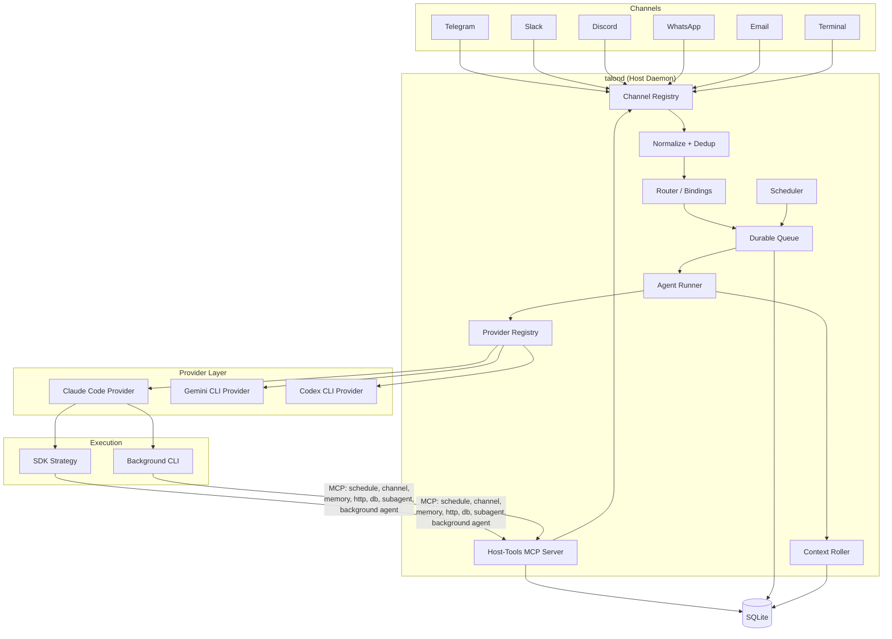
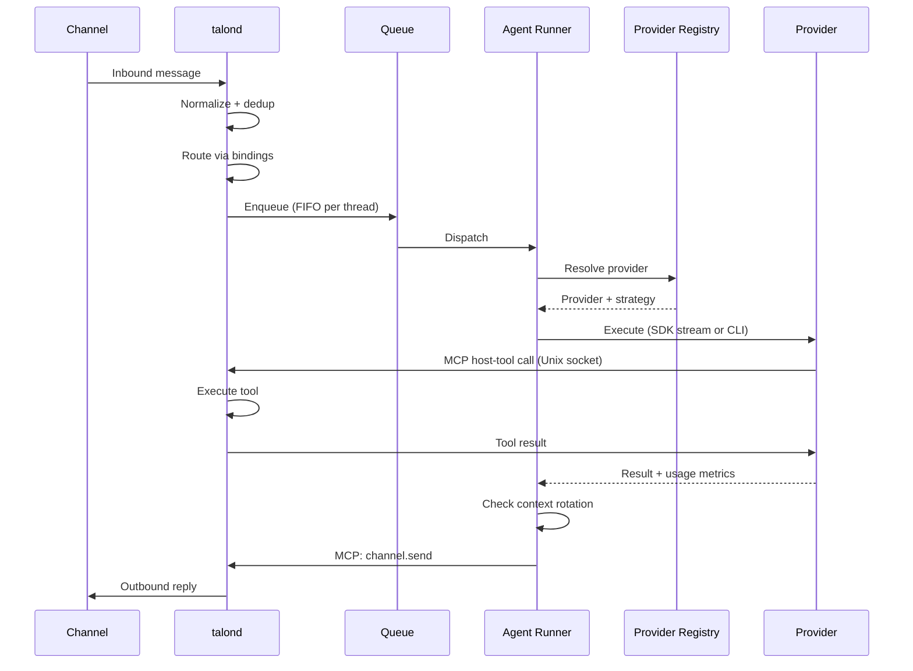

<p align="center">
    
  </p>

# Talon

**Self-hosted AI agents that work where you do.**

[](#testing)
[](https://nodejs.org)
[](LICENSE)
[](https://www.typescriptlang.org)

---

## What is Talon?

Talon is an open-source runtime for long-lived AI workflows. Connect a persona to the channels and tools you already use, choose its model provider and tool boundaries, and run it on infrastructure you control.

It is for operators who want more than another chat window: a personal or small-team assistant that can retain context, run scheduled work, and use explicitly configured integrations. Talon is self-hosted software, not a hosted AI service. External model providers and MCP servers receive only the data you choose to send to them.

### Why Talon?

- **Useful across your existing tools** — connect chat channels, schedules, skills, and MCP integrations around one assistant.
- **Runs where you choose** — deploy Talon yourself and select the model endpoint and integrations that fit your needs.
- **Built to keep working** — a durable queue, persistent threads, and background execution support work that outlives a single message.
- **Explicit boundaries** — personas receive only configured host-tool capabilities; host-side effects are audit logged.
- **Composable by design** — use one persona for one job or route work among specialised personas when the workflow warrants it.

---

## Quick start (Docker)

The fastest way to run Talon — no clone, no build, no toolchain. Download
the starter bundle, add your tokens, and bring it up:

```bash
# 1. Download and extract the starter bundle
curl -fsSL https://github.com/ivo-toby/talon/releases/latest/download/talon-starter.tar.gz | tar xz
cd talon-starter

# 2. Install the talonctl helper (no sudo)
./install.sh

# 3. Configure
cp .env.example .env                              # add your bot token + provider key
cp config/talond.example.yaml config/talond.yaml  # set allowedChatIds, pick a provider

# 4. Run
docker compose up -d
talonctl status
```

The daemon image is published to `ghcr.io/ivo-toby/talond` — multi-arch
(linux/amd64 + linux/arm64), `:latest` plus per-release tags. The compose
file pulls it for you; there is nothing to build.

**Guided setup with Claude Code.** The bundle ships a setup skill — run
`claude` in the extracted folder and type `/talon-setup-docker` to be
walked through provider choice, channel config, and first boot
conversationally.

Full bundle reference: [`starter/README.md`](starter/README.md). Prefer
running from a source clone as a systemd service? See
[Quick start (from source)](#quick-start-from-source).

### Is Talon a fit?

Talon is a good fit if you are comfortable operating self-hosted software and
want to connect AI to your own channels and services. It is not a consumer
assistant, a hosted SaaS, or a guarantee that an external model provider,
integration, or automation is safe without your configuration and review.

---

## Features

### Home Assistant add-on

Home Assistant users can install Talon using the [Home Assistant add-on](talon-haos/README.md). It provides a managed daemon, an ingress-protected terminal and private persistent workspaces. See the add-on documentation for storage, access restrictions and upgrade considerations. The add-on image is versioned separately from the daemon.

Add-on 1.0.10 removes disabled Docker healthcheck metadata that could leave
Supervisor waiting in `startup`. See [startup verification](talon-haos/DOCS.md#startup-verification)
for the distinction between image tests and validation on a running HA installation.

### Channels

- **Telegram** — Long polling with MarkdownV2 formatting
- **Slack** — Socket Mode with mrkdwn formatting
- **Terminal** — WebSocket server with `talonctl chat` client, rendered markdown output, persistent threads
- **Discord** — Gateway events with REST API, rate limit handling _(inbound not yet implemented)_
- **WhatsApp** — WhatsApp Web bridge via Baileys, supports dedicated number or self-chat mode
- **Email** — IMAP polling + SMTP send, thread tracking via In-Reply-To headers _(not yet tested)_

### Agent System

- **Persona-per-channel** — Each channel gets its own agent with a dedicated system prompt, model, tools, and capabilities
- **Provider-based execution** — Agents run through the configured provider runtime (Claude uses the Anthropic SDK path; Gemini and Codex use CLI strategies)
- **Per-thread memory** — Each conversation thread gets its own workspace with transcript, working memory, and artifacts
- **Skills** — Modular prompt and tool bundles with lazy loading (metadata-only in system prompt, full content on demand)
- **MCP integration** — Connect external MCP tool servers via stdio, HTTP, or SSE; Talon applies persona policy to its own host-tools bridge

### Provider choice

Choose the model runtime that fits your deployment. Talon keeps personas, channels, scheduling, and host-tool policy in its own layer while provider adapters execute the model call.

Under the hood, the provider layer separates the daemon from the model runtime, so changing or adding a provider does not require changes to the runner, queue, or context management. Each provider prepares an execution invocation, parses output, estimates context usage, and creates a runtime strategy. The daemon resolves providers separately for foreground and background agents.

The current provider matrix is deliberately implementation detail: Claude Code is the default; Gemini CLI and Codex CLI are supported; and the **experimental** Mastra-backed OpenAI-compatible provider can use Ollama, vLLM, Groq, and other compatible endpoints. Provider entries can set `type` to reuse an implementation under another name, such as `ollama-mac` alongside an Ollama Cloud entry.

This matters because it means you can:

- Run different providers for foreground vs background work (e.g., Claude for interactive, a local model for batch tasks)
- Add new providers without touching core pipeline code — implement the interface, register in config, done
- Configure provider-specific context windows and context-management policy per agent-runner provider
- Keep provider defaults simple while failing fast on removed legacy `context` config that now requires migration

```yaml
agentRunner:
  defaultProvider: claude-code
  providers:
    claude-code:
      enabled: true
      command: claude
      contextWindowTokens: 200000
      contextManagement:
        enabled: true
        triggerMetric: cache_read_input_tokens
        thresholdRatio: 0.5
        recentMessageCount: 10
        summarizer: session-summarizer
    codex-cli:
      enabled: false
      command: codex
      contextWindowTokens: 400000
      contextManagement:
        enabled: true
        triggerMetric: cache_read_input_tokens
        thresholdRatio: 0.8
        recentMessageCount: 10
        summarizer: session-summarizer
      options:
        defaultModel: gpt-5.4
    openai-compatible: # experimental
      enabled: false
      command: node
      contextWindowTokens: 256000
      contextManagement:
        enabled: true
        triggerMetric: input_tokens
        thresholdRatio: 0.75
        recentMessageCount: 10
        summarizer: session-summarizer
      options:
        baseUrl: http://127.0.0.1:11434/v1
        defaultModel: qwen3-coder:30b
        providerId: ollama
    ollama-mac: # alias using the same implementation
      enabled: false
      type: openai-compatible
      command: node
      contextWindowTokens: 128000
      contextManagement:
        enabled: true
        triggerMetric: input_tokens
        thresholdRatio: 0.75
        recentMessageCount: 10
        summarizer: session-summarizer
      options:
        baseUrl: http://mac.local:11434/v1
        defaultModel: qwen3-coder:30b
        providerId: ollama-mac
        providerOptions:
          chat_template_kwargs:
            enable_thinking: false

backgroundAgent:
  enabled: true
  maxConcurrent: 3
  defaultProvider: claude-code
  providers:
    claude-code:
      enabled: true
      command: claude
      contextWindowTokens: 200000
    codex-cli:
      enabled: false
      command: codex
      contextWindowTokens: 400000
      options:
        defaultModel: gpt-5.4
    openai-compatible:
      enabled: false
      command: node
      contextWindowTokens: 256000
      options:
        baseUrl: http://127.0.0.1:11434/v1
        defaultModel: qwen3-coder:30b
        providerId: ollama
    ollama-mac:
      enabled: false
      type: openai-compatible
      command: node
      contextWindowTokens: 128000
      options:
        baseUrl: http://mac.local:11434/v1
        defaultModel: qwen3-coder:30b
        providerId: ollama-mac
        providerOptions:
          chat_template_kwargs:
            enable_thinking: false
```

### Infrastructure

- **Durable queue** — SQLite-backed message queue with crash recovery, retry, and dead-letter
- **Scheduler** — Agent-managed cron, interval, and one-shot scheduled tasks
- **Host-tools MCP bridge** — Built-in host tools (schedule, channel, memory, http, db, execution env, subagent, background agent) exposed via Unix socket
- **Sub-agent system** — Route mechanical LLM tasks (summarization, memory grooming, search) to API models or an existing Claude Code subscription via pluggable sub-agents
- **Background agents** — Launch long-running provider workers for deep tasks without blocking the foreground conversation
- **Sandboxed execution environments** — Isolate background agent work in persistent Firecracker VMs via [Sprites.dev](https://sprites.dev), with file transfer, checkpointing, and automatic cleanup
- **Hot reload** — Change config, personas, and skills without restarting the daemon
- **Systemd integration** — Watchdog heartbeat, graceful shutdown, timer-based wake-only mode
- **Session persistence** — Resumable agent sessions resume across messages in the same thread, scoped by provider, model, and configured reasoning effort so model or effort swaps start fresh
- **Provider-scoped context management** — Per-provider session rotation policy for latency or cost control, with compressed history injection into fresh sessions

### Observability (Langfuse)

- **Trace every agent run** — Each message-to-response cycle becomes a Langfuse trace with spans for agent execution, tool calls, and LLM generations
- **OpenTelemetry-native** — Built on the `@langfuse/otel` span processor and the standard `NodeTracerProvider`
- **No overhead when disabled** — A noop service replaces the real one; no Langfuse initialization or network traffic
- **Self-hosted or cloud** — Point `baseUrl` at your own Langfuse instance or use Langfuse Cloud

### Security

- **Default-deny capabilities** — Tools are gated by capability labels (`channel.send`, `schedule.manage`, etc.)
- **Scoped host-tool access** — Personas expose only the configured host tools
- **Secrets management** — Credentials via `${ENV_VAR}` substitution, never hardcoded in config
- **Audit logging** — Every side-effecting operation recorded with full provenance

---

## Architecture

Messages arrive from channels, pass through a durable queue, and get dispatched to the agent runner. The runner resolves a provider from the registry and executes via that provider's strategy (SDK streaming or CLI). Agents interact with the host through MCP host-tools on a Unix socket. Background agents run as separate provider-managed processes.



### Message flow



---

## Quick start (from source)

Run Talon from a clone — the path for native/systemd deployments and
local development. For the zero-build container path, see
[Quick start (Docker)](#quick-start-docker) above.

For the full deployment walkthrough, see the [setup guide](docs/setup-guide.md).

### Prerequisites

- **Node.js 24+**
- **Claude Code** (default provider), and optionally **Gemini CLI** and/or **Codex CLI** installed and authenticated
- **SQLite** (ships with better-sqlite3, no separate install)

### Install

```bash
git clone https://github.com/ivo-toby/talon.git
cd talon
npm install
npm run build
```

### First-Time Setup

```bash
# Run interactive setup — checks environment, creates directories, generates config
npx talonctl setup

# Add a Telegram channel
npx talonctl add-channel --name my-telegram --type telegram

# Add a persona (copies system.md from templates/ if available)
npx talonctl add-persona --name assistant

# Run database migrations
npx talonctl migrate

# Check everything is ready
npx talonctl doctor
```

### Start the Daemon

```bash
# Direct
node dist/index.js --config talond.yaml

# Or via npm
npm run talond
```

---

## Configuration

Talon uses a single YAML configuration file. A fully annotated example ships at [`talond.yaml.example`](talond.yaml.example).

### Minimal Configuration

```yaml
storage:
  type: sqlite
  path: data/talond.sqlite

queue:
  maxAttempts: 3
  backoffBaseMs: 1000
  backoffMaxMs: 60000
  concurrencyLimit: 5

backgroundAgent:
  enabled: true
  maxConcurrent: 3
  defaultTimeoutMinutes: 30
  claudePath: claude # legacy shortcut for claude-code; prefer defaultProvider + providers

personas:
  - name: assistant
    model: claude-sonnet-4-6
    systemPromptFile: personas/assistant/system.md
    skills: []
    subagents:
      - session-summarizer
      - memory-groomer
      - memory-retriever
      - file-searcher
    capabilities:
      allow:
        - channel.send:telegram
        - fs.read:*
        - memory.access:*
        - subagent.invoke:*
        - subagent.background
    maxConcurrent: 2

channels:
  - name: my-telegram
    type: telegram
    enabled: true
    config:
      token: ${TELEGRAM_BOT_TOKEN}
      allowedUserIds:
        - 123456789
      pollIntervalMs: 1000

scheduler:
  tickIntervalMs: 5000

auth:
  mode: subscription
  providers:
    anthropic:
      apiKey: ${SUBAGENT_ANTHROPIC_API_KEY}
    openai:
      apiKey: ${OPENAI_API_KEY}

agentRunner:
  defaultProvider: claude-code
  providers:
    claude-code:
      enabled: true
      command: claude
      contextWindowTokens: 1000000
      contextManagement:
        enabled: true
        triggerMetric: cache_read_input_tokens
        thresholdRatio: 0.5
        recentMessageCount: 10
        summarizer: session-summarizer
    openai-compatible: # experimental
      enabled: false
      command: node
      contextWindowTokens: 256000
      contextManagement:
        enabled: true
        triggerMetric: input_tokens
        thresholdRatio: 0.75
        recentMessageCount: 10
        summarizer: session-summarizer
      options:
        baseUrl: http://127.0.0.1:11434/v1
        defaultModel: qwen3-coder:30b
        providerId: ollama

logLevel: info
dataDir: data
```

### Configuration Sections

| Section                | Purpose                                                                       |
| ---------------------- | ----------------------------------------------------------------------------- |
| `storage`              | Database backend and SQLite path                                              |
| `queue`                | Retry/backoff/concurrency controls for durable queue processing               |
| `agentRunner`          | Foreground provider config, including provider-scoped context management      |
| `backgroundAgent`      | Enable and tune long-running background provider workers                      |
| `personas`             | Persona profiles: model, system prompt, skills, capabilities                  |
| `channels`             | Channel connector entries with `type`, `name`, and connector `config` payload |
| `bindings`             | Channel-to-persona routing with default persona per channel                   |
| `schedules`            | Agent-managed schedule entries (cron, interval, one-shot)                     |
| `scheduler`            | Scheduler tick interval                                                       |
| `auth`                 | `subscription` or `api_key` authentication mode                               |
| `subagentCli`          | Opt-in direct Claude Code adapter for bounded sub-agent generations             |
| `langfuse`             | Langfuse observability: API keys, base URL, environment, flush settings       |
| `sprites`              | Sprites.dev execution environments: token, resource limits, defaults          |
| `logLevel` / `dataDir` | Runtime logging level and data root                                           |

For the context-management strategies and migration details, see [docs/context-management.md](docs/context-management.md).

### Environment Variable Substitution

Credential fields support `${ENV_VAR}` syntax so you never hardcode secrets:

```yaml
channels:
  - name: my-telegram
    type: telegram
    config:
      botToken: ${TELEGRAM_BOT_TOKEN}
```

---

### Background Agent Workers

Talon includes a `background_agent` host tool for work that should keep running after the foreground turn returns. Typical examples are repo-wide refactors, large code searches, or longer research/coding tasks that should not block the active conversation.

This was added because Talon already had two extremes:

- the normal foreground agent turn, which is interactive and should stay responsive
- short synchronous sub-agents, which are useful for mechanical delegation but intentionally limited

Some tasks need the full provider CLI runtime and the persona's prompt + external MCP context, but they should still run out-of-band. Background agents fill that gap: the foreground agent starts a worker, gets a task ID immediately, and Talon tracks the worker to completion in SQLite.

The lifecycle is durable:

- Talon persists task state in the database
- the daemon enforces a concurrency limit
- completion, failure, timeout, and cancellation are recorded
- the originating thread gets a normal completion message through the existing queue and channel-send path

Background workers get a filtered version of Talon's host-tools MCP server based on the persona's capabilities. The `background_agent` tool is always excluded to prevent recursive spawning. When `sandbox=true`, the worker also gets the `execution_env` tool for running commands, transferring files, and checkpointing inside an isolated Sprite VM.

For sandboxed execution environments, see [Execution Environments (Sprites)](#execution-environments-sprites) below.

#### Configuration

```yaml
backgroundAgent:
  enabled: true
  maxConcurrent: 3
  defaultTimeoutMinutes: 30
  defaultProvider: claude-code
  providers:
    claude-code:
      enabled: true
      command: claude
      contextWindowTokens: 200000
    # Any of the other providers (gemini-cli, codex-cli, openai-compatible)
    # can be enabled here the same way they are in `agentRunner.providers`.
```

| Option                  | Meaning                                                          |
| ----------------------- | ---------------------------------------------------------------- |
| `enabled`               | Globally enable or disable background workers                    |
| `maxConcurrent`         | Maximum number of background provider workers allowed at once    |
| `defaultTimeoutMinutes` | Default wall-clock timeout when a tool call does not provide one |
| `defaultProvider`       | Provider used for tasks that do not specify one explicitly       |
| `providers`             | Per-provider config; mirrors `agentRunner.providers`             |

##### Per-persona override

Personas can route their background agents through a different provider/model than their foreground runtime by setting `backgroundProvider` and (optionally) `backgroundModel`:

```yaml
personas:
  - name: assistant
    model: qwen3-coder:30b
    provider: openai-compatible # foreground stays on Ollama
    backgroundProvider: claude-code # background runs on Claude Code
    backgroundModel: claude-sonnet-4-6
  - name: work-context-manager
    model: qwen3-coder:30b
    provider: openai-compatible
    # no backgroundProvider — falls back to backgroundAgent.defaultProvider
```

`backgroundProvider` must be enabled under `backgroundAgent.providers`; the daemon refuses to start otherwise. `backgroundModel` is paired with `backgroundProvider` — setting it without `backgroundProvider` is rejected at config load. When a background run resolves its provider/model from persona configuration, Talon also forwards that persona's `reasoningEffort`; explicitly supplied background provider/model tool arguments do not inherit it.

Resolution order at spawn time:

1. Provider given explicitly in the `background_agent` tool call (strict)
2. Persona's `backgroundProvider`
3. Persona's foreground `provider` — **only** if it is also enabled in `backgroundAgent.providers`
4. `backgroundAgent.defaultProvider`

##### Using `openai-compatible` for background agents

`openai-compatible` (**experimental**) works as a background provider alongside the foreground `agentRunner` entry. Add it under `backgroundAgent.providers` the same way you would for the main agent:

```yaml
backgroundAgent:
  enabled: true
  maxConcurrent: 2
  defaultTimeoutMinutes: 30
  defaultProvider: openai-compatible # or keep claude-code and opt in per task
  providers:
    openai-compatible:
      enabled: true
      command: node # the bundled wrapper runs under node
      contextWindowTokens: 256000
      options:
        baseUrl: ${OLLAMA_BASE_URL} # e.g. https://ollama.com/v1
        defaultModel: ${OLLAMA_AGENT_MODEL}
        providerId: ollama # triggers auth.providers.ollama lookup
```

Notes:

- **Credentials are shared.** The background factory resolves them the same way the foreground one does — `auth.providers.<options.providerId>` first (e.g. `auth.providers.ollama`), falling back to `auth.providers.openai-compatible`. Nothing extra under `auth:` is needed if the agentRunner entry already works.
- **Background runs don't stream.** The wrapper still runs Mastra's streaming API internally, but only emits a terminal summary on stdout and writes the full response to a temp `last-message.txt` file. This bypasses the 100 KB stdout buffer cap, so long outputs are never truncated.
- **Tool calls still execute.** The background worker uses the same filtered host-tools MCP bridge as `claude-code`/`codex-cli` background workers; per-persona capabilities apply. Tool-call messages just aren't streamed to a channel because background runs don't have a live connection.
- **Per-task override.** If you'd rather keep `defaultProvider: claude-code` and only route specific tasks through `openai-compatible`, pass the provider explicitly when dispatching the background task (same mechanism as routing to `codex-cli`).

To let a persona use the feature, grant `subagent.background`:

```yaml
personas:
  - name: assistant
    capabilities:
      allow:
        - subagent.background
```

---

## Channel Connectors

Each connector implements the `ChannelConnector` interface: `start()`, `stop()`, `onMessage()`, `send()`, and `format()`. All connectors convert Markdown output to channel-native formatting automatically.

#### Common Channel Options

Every channel entry supports these optional top-level fields in addition to the connector-specific `config` block:

| Option          | Type    | Default | Description                                                                   |
| --------------- | ------- | ------- | ----------------------------------------------------------------------------- |
| `enabled`       | boolean | `true`  | Enable or disable the channel                                                 |
| `showToolCalls` | boolean | `false` | Send a human-readable message to the channel each time the agent calls a tool |

When `showToolCalls` is enabled, each tool invocation produces a short status message in the channel (e.g. _"🌐 Using Brave Search: query"_), giving users visibility into what the agent is doing behind the scenes.

```yaml
channels:
  - name: my-channel
    type: slack
    showToolCalls: true # sends a message like "🌐 Using Brave Search: web search" on each tool call
    config:
      botToken: ${SLACK_BOT_TOKEN}
      appToken: ${SLACK_APP_TOKEN}
```

### Telegram

Long-polling connector using the Telegram Bot API.

```yaml
channels:
  - name: my-telegram
    type: telegram
    enabled: true
    config:
      botToken: ${TELEGRAM_BOT_TOKEN}
      pollingTimeoutSec: 30
      allowedChatIds:
        - 123456789
```

- **Inbound**: Long polling via `getUpdates`
- **Outbound**: `sendMessage` with MarkdownV2 parse mode
- **Idempotency key**: `update_id`
- **Thread mapping**: `chat_id`

### Slack

Event-driven connector for Slack's Events API or Socket Mode.

```yaml
channels:
  - name: my-slack
    type: slack
    enabled: true
    config:
      botToken: ${SLACK_BOT_TOKEN}
      appToken: ${SLACK_APP_TOKEN}
      signingSecret: ${SLACK_SIGNING_SECRET}
```

- **Inbound**: Events API webhooks or Socket Mode
- **Outbound**: `chat.postMessage` Web API
- **Idempotency key**: `event_id` > `client_msg_id` > `channel:ts`
- **Thread mapping**: `channel_id:thread_ts`
- **Format**: Slack mrkdwn (`*bold*`, `_italic_`, `` `code` ``)

### Discord

> **Not yet implemented**: The connector has send support and a `feedEvent()` ingestion method, but no Gateway WebSocket client to actually receive events from Discord. Needs a Gateway client similar to the Slack Socket Mode implementation. See TASK-043.

Push-based connector using the Discord Gateway and REST API.

```yaml
channels:
  - name: my-discord
    type: discord
    enabled: true
    config:
      botToken: ${DISCORD_BOT_TOKEN}
      applicationId: '123456789'
      allowedChannelIds:
        - '987654321'
```

- **Inbound**: Gateway `MESSAGE_CREATE` events
- **Outbound**: REST API `POST /channels/{id}/messages`
- **Idempotency key**: Message snowflake ID
- **Thread mapping**: `channel_id:message_id`
- **Rate limiting**: Automatic retry with `Retry-After` header handling

### WhatsApp Business (Cloud API)

Meta Cloud API connector with an embedded webhook HTTP server for inbound events. Requires a Meta Business account with a WhatsApp-enabled phone number.

```yaml
channels:
  - name: my-whatsapp-business
    type: whatsappBusiness
    enabled: true
    config:
      phoneNumberId: '123456789'
      accessToken: ${WHATSAPP_ACCESS_TOKEN}
      verifyToken: ${WHATSAPP_VERIFY_TOKEN}
      appSecret: ${WHATSAPP_APP_SECRET} # enables inbound webhook server
      webhookPort: 3000 # default: 3000
      webhookHost: '0.0.0.0' # default: 0.0.0.0
      webhookPath: '/webhook' # default: /webhook
```

- **Inbound**: Embedded HTTP server handles Meta webhook verification (GET) and signed event delivery (POST with HMAC-SHA256 validation). Requires a public URL — use a reverse proxy (nginx, Caddy) or ngrok for local dev.
- **Outbound**: REST API `POST /v21.0/{phoneNumberId}/messages`
- **Idempotency key**: WhatsApp message ID
- **Thread mapping**: Sender phone number

### WhatsApp Baileys

WhatsApp Web bridge using the [Baileys](https://github.com/WhiskeySockets/Baileys) library. Connects as a regular WhatsApp Web client — no Meta Business account, no webhook server, no Cloud API.

> **Optional dependency**: `@whiskeysockets/baileys` is not bundled. Install it separately: `npm install @whiskeysockets/baileys`

Two usage modes: **dedicated number** (default) or **self-chat** (use your personal WhatsApp).

**Dedicated number** — a second WhatsApp account receives messages from others:

```yaml
channels:
  - name: my-whatsapp
    type: whatsappBaileys
    enabled: true
    config:
      authDir: './baileys-auth'
      allowedSenders: # Restrict who can message the bot
        - '96490886312027'
```

**Self-chat** — the bot listens in your own "Message Yourself" thread. No second phone needed:

```yaml
channels:
  - name: my-whatsapp
    type: whatsappBaileys
    enabled: true
    config:
      authDir: './baileys-auth'
      selfChat: true
      triggerWords: ['@Talon'] # Optional — filter by trigger word
```

#### Self-Chat Mode

Set `selfChat: true` to use your personal WhatsApp number. The bot only listens to messages you send in your own "Message Yourself" conversation (WhatsApp's built-in self-chat). All other conversations are ignored. No `allowedSenders` needed — only your own messages are processed.

#### Trigger Words

`triggerWords` filters messages so only those starting with a listed word are processed. The trigger word is stripped before the message reaches the agent — e.g. `@Talon what's the weather?` becomes `what's the weather?`. Case-insensitive.

Useful in self-chat mode (so not every note-to-self triggers the bot) or with a dedicated number in group-like scenarios. When omitted or empty, all messages pass through.

#### Access Control

For dedicated-number mode, use `allowedSenders` to restrict who can message the bot. When omitted or empty, all senders are accepted.

**Finding sender IDs:** WhatsApp uses opaque "LID" identifiers (e.g. `96490886312027@lid`) rather than phone numbers in many cases. You cannot predict which format a contact will use, so discover IDs from the logs:

1. Set `logLevel: debug` in `talond.yaml`
2. Start (or restart) talond
3. Send a test message from each phone that should be allowed
4. Find the log line `whatsapp-baileys: inbound message received` — the `jid` field shows the full identifier
5. Copy the part **before the `@`** (e.g. `96490886312027`) into `allowedSenders`
6. Set `logLevel` back to `info` and restart

#### Authentication

Baileys authenticates by scanning a QR code, like linking a new device in WhatsApp. Use the standalone CLI command to authenticate before starting the daemon:

```bash
# Authenticate — prints QR code, waits for scan, saves credentials
npx talonctl whatsapp-auth --auth-dir ./baileys-auth

# Custom timeout (default: 120s)
npx talonctl whatsapp-auth --auth-dir ./baileys-auth --timeout 180
```

Once authenticated, the daemon uses the saved credentials — no QR code display needed at runtime. To re-authenticate, delete the `authDir` folder and run the command again.

- **Access control**: Optional `allowedSenders` allowlist (dedicated-number mode) or `selfChat: true` (personal number)
- **Trigger words**: Optional `triggerWords` filter — trigger is stripped before reaching the agent
- **Inbound**: WhatsApp Web socket via Baileys, text messages from individual chats only (group and media messages logged and skipped in v1)
- **Outbound**: Send via Baileys socket using WhatsApp JID (e.g. `447700900000@s.whatsapp.net`)
- **Idempotency key**: Baileys message ID
- **Thread mapping**: Sender JID
- **Reconnection**: Automatic on disconnect; logged-out sessions require re-authentication (delete `authDir` and re-run `talonctl whatsapp-auth`)

### Email

> **Not yet tested**: The connector has IMAP polling and SMTP send implementations, but has not been tested end-to-end. See TASK-049.

Dual-mode connector with IMAP polling and SMTP outbound.

```yaml
channels:
  - name: my-email
    type: email
    enabled: true
    config:
      imapHost: imap.gmail.com
      imapPort: 993
      imapUser: agent@example.com
      imapPass: ${EMAIL_PASSWORD}
      imapSecure: true
      smtpHost: smtp.gmail.com
      smtpPort: 587
      smtpUser: agent@example.com
      smtpPass: ${EMAIL_PASSWORD}
      smtpSecure: false
      fromAddress: 'Talon <agent@example.com>'
```

- **Inbound**: IMAP polling (or webhook via `feedInbound()`)
- **Outbound**: SMTP with HTML formatting
- **Idempotency key**: `Message-ID` header
- **Thread mapping**: `In-Reply-To` / `References` headers
- **Format**: Markdown to HTML conversion

### Terminal

WebSocket-based connector for direct CLI access to any persona. Connect from any machine with `talonctl chat`.

```yaml
channels:
  - name: my-terminal
    type: terminal
    enabled: true
    config:
      port: 7700
      host: 0.0.0.0
      token: ${TERMINAL_TOKEN}
```

- **Inbound**: WebSocket JSON messages from `talonctl chat`
- **Outbound**: JSON response over WebSocket, client renders with `marked-terminal`
- **Auth**: Shared token with constant-time comparison, 64KB max payload, 10s auth timeout
- **Thread mapping**: `clientId` — same client always gets the same conversation thread
- **Persona override**: `--persona` flag switches persona at connect time
- **Format**: Raw markdown passthrough (client handles rendering)

#### Connecting

```bash
# Set token via env var or --token flag
export TERMINAL_TOKEN=your-secret-token

# Connect to a running Talon instance
talonctl chat --host 10.0.1.95 --port 7700 --persona assistant

# Or with explicit token
talonctl chat --host 10.0.1.95 --port 7700 --token your-secret-token

# Custom client ID for persistent thread identity
talonctl chat --host 10.0.1.95 --port 7700 --client-id my-laptop
```

The client provides:

- Rendered markdown output via `marked-terminal`
- Typing spinner (`ora`) while the agent works
- Persistent conversation — reconnecting with the same `clientId` resumes the thread
- Graceful disconnect on Ctrl+C

---

## Multi-Connector Setup

You can run N connector instances of the same channel type — for example, …31255 tokens truncated…     # Atomic file write
      ipc-reader.ts              # Directory poll + validate
      ipc-channel.ts             # Bidirectional IPC channel
      daemon-ipc-server.ts       # talond <-> talonctl IPC
    mcp/
      mcp-proxy.ts               # MCP tool proxy
      mcp-registry.ts            # MCP server registry
    memory/
      memory-manager.ts          # Memory read/write/delete
      thread-workspace.ts        # Per-thread filesystem layout
      context-builder.ts         # Prompt context assembly
    personas/
      persona-loader.ts          # Load + validate personas
      capability-merger.ts       # Persona x skill capability resolution
    pipeline/
      message-normalizer.ts      # Inbound message normalization
      message-pipeline.ts        # Normalize -> dedup -> route -> enqueue
    queue/
      queue-manager.ts           # Queue lifecycle + processing loop
      queue-processor.ts         # Item processing with retry
      retry-strategy.ts          # Exponential backoff with jitter
      dead-letter.ts             # Dead-letter queue management
    sandbox/
      sandbox-manager.ts         # Agent lifecycle management
      agent-runner.ts            # Provider query dispatch
      session-tracker.ts         # Session resume tracking
    scheduler/
      scheduler.ts               # Tick-based schedule processor
      cron-evaluator.ts          # Cron expression evaluation
    skills/
      skill-loader.ts            # Load + validate skills
      skill-resolver.ts          # Skill -> persona resolution
    subagents/
      subagent-types.ts          # Core type definitions
      subagent-schema.ts         # Zod manifest validation
      subagent-loader.ts         # Load sub-agents from directories
      model-resolver.ts          # API-model factory + direct subscription CLI adapters
      subagent-model-chain.ts    # Shared resolution, timeout, and failover logic
      subscription-cli-language-model.ts # Isolated Claude Code AI SDK adapter
      subagent-runner.ts         # Execution engine with timeout
      index.ts                   # Barrel export
      default/                   # Built-in sub-agents
        session-summarizer/      # Transcript compression (legacy)
        session-observer/        # Observational memory — observation generation
        session-reflector/       # Observational memory — observation consolidation
        memory-groomer/          # Memory consolidation
        memory-retriever/        # Memory search + LLM reranking
        file-searcher/           # File search (rg/grep/node cascade)
    tools/
      host-tools/                # Host-side tool handlers
        channel-send.ts          # Send via channel connector
        http-proxy.ts            # Fetch with domain allowlist
        memory-access.ts         # Thread memory CRUD
        schedule-manage.ts       # Schedule CRUD
        db-query.ts              # Read-only DB queries
        subagent-invoke.ts       # Invoke sub-agents
      tool-registry.ts           # Tool manifest registry
      policy-engine.ts           # Capability-based access control
      capability-resolver.ts     # Label resolution
    usage/
      token-tracker.ts           # Token usage recording + aggregation
  tests/
    unit/                        # Unit tests (mirrors src/ structure)
    integration/                 # Integration + e2e tests
```

---

## Data Model

Talon uses SQLite with WAL mode and foreign keys. All persistence goes through the repository pattern for future Postgres portability.

### Tables

| Table          | Purpose                                                         |
| -------------- | --------------------------------------------------------------- |
| `channels`     | Channel connector configurations                                |
| `personas`     | Agent profiles and capabilities                                 |
| `bindings`     | Channel+thread to persona routing                               |
| `threads`      | Conversation thread metadata                                    |
| `messages`     | Normalized inbound/outbound messages                            |
| `queue_items`  | Durable work queue with retry state                             |
| `runs`         | Agent execution records (supports parent/child for multi-agent) |
| `schedules`    | Cron/interval/one-shot job definitions                          |
| `memory_items` | Structured per-thread memory                                    |
| `artifacts`    | Agent output files                                              |
| `audit_log`    | Append-only audit trail                                         |
| `tool_results` | Idempotent tool result cache                                    |

---

## Multi-Agent Collaboration

Talon's data model supports supervisor/worker patterns via `parent_run_id` in the `runs` table. Full multi-agent collaboration (provider runtime subagent/Task tool support) is planned in TASK-054.

---

## Agent-to-Agent Communication (A2A)

Talon implements [Google's A2A protocol](https://google.github.io/A2A/) for internal persona-to-persona task routing. Any persona can delegate a task to another persona without human involvement, enabling supervisor/worker workflows and specialised delegation chains.

### How it works

Each persona is automatically discoverable as an A2A agent with a card describing its capabilities, skills, and endpoint. When persona A needs to delegate work to persona B, it submits a task via the internal A2A server. The task is persisted to the `a2a_tasks` table, enqueued as a `collaboration` queue item, and processed by the daemon exactly like any other message — but against the target persona's full model configuration.

For agent-facing delegation, Talon exposes three host tools behind the same capability family:

- `persona_send` submits a delegated task
- `persona_task_status` fetches the current status or final result later
- `persona_list` lists available target personas

All three are granted by the same capability label: `persona.send:*`. No separate capability is needed for task status lookups.

```
Persona A (source)
    │
    │  tasks/send  (JSON-RPC)
    ▼
A2A Server  ──►  a2a_tasks (submitted)
    │
    ▼
Collaboration Queue
    │
    ▼
AgentRunner  ──►  Persona B (target)
    │
    ▼
a2a_tasks (completed / failed)
```

### Task lifecycle states

| State            | Meaning                                       |
| ---------------- | --------------------------------------------- |
| `submitted`      | Task accepted, enqueued for processing        |
| `working`        | AgentRunner has started processing            |
| `input-required` | Target persona is waiting for clarification   |
| `completed`      | Target persona finished and returned a result |
| `failed`         | Processing failed with an error code          |
| `canceled`       | Task was canceled before completion           |

### Agent-facing flow

The normal synchronous pattern is:

1. Call `persona_send` with `await_reply: true`
2. If the delegated task finishes quickly, the caller receives the final result directly
3. If the sync wait expires, the caller receives a structured timeout response with the `task_id`
4. The caller can then use `persona_task_status` to poll or wait for the final result without querying the raw database

`persona_send` now waits up to 5 minutes by default when `await_reply: true`. You can override that with `timeout_ms`. `persona_task_status` supports an optional `wait_ms` parameter for polling until the task reaches a terminal state.

Examples:

```json
{
  "target_persona": "work-context-manager",
  "message": "Fetch the latest Jira and Confluence updates",
  "await_reply": true,
  "timeout_ms": 300000
}
```

```json
{
  "task_id": "2b004602-b6ac-4dec-bd7b-f88e0565a16a",
  "wait_ms": 300000
}
```

### CLI commands

**List tasks:**

```bash
# List the 20 most recent A2A tasks
talonctl a2a list

# Filter by state and target persona
talonctl a2a list --status working --target software-engineer

# Show more results
talonctl a2a list --limit 50
```

**Send a task manually (for testing):**

```bash
# Submit a task to a persona and receive the task ID
talonctl a2a send software-engineer "Review the latest PR and summarise findings"

# Specify a source persona name (defaults to "cli")
talonctl a2a send software-engineer "Run the test suite" --source james
```

`a2a send` inserts a task directly into the database and enqueues it for processing. If the daemon is running, the task will be picked up immediately. If not, it will be processed on next daemon start.

### Configuration

A2A runtime limits live under the top-level `a2a:` block in `talond.yaml`. All
three keys are optional and fall back to the built-in defaults shown below:

```yaml
a2a:
  maxHops: 4 # max delegation chain depth (1..32)
  maxConcurrentPerTarget: 1 # max in-flight tasks per target persona (1..100)
  maxAttempts: 3 # max queue retries before dead-letter (1..20)
```

- **`maxHops`** — a task is rejected when its incoming `hopCount >= maxHops`.
  Raise this if your supervisor/worker chains genuinely need more depth.
- **`maxConcurrentPerTarget`** — admission control at submission time. Submissions
  beyond the cap fail with a "Max allowed" error. Raise this to allow parallel
  fan-out to the same persona.
- **`maxAttempts`** — retry budget for the `collaboration` queue items that
  carry A2A tasks. After this many failures the item is dead-lettered.

### Milestone 1 scope

The current implementation covers:

- Internal-only task routing (no external HTTP exposure)
- Single-hop and multi-hop delegation (configurable via `a2a.maxHops`, default 4)
- Concurrency admission per target persona (configurable via
  `a2a.maxConcurrentPerTarget`, default 1)
- Configurable queue retry budget (`a2a.maxAttempts`, default 3)
- Full task lifecycle tracking in `a2a_tasks` table
- Agent card discovery per persona
- CLI commands for listing and submitting tasks

### Coming in Milestone 2

- External A2A endpoint exposure (authenticated HTTP, for cross-instance routing)
- Per-task capability grants (fine-grained source/target permissions)
- A2A task monitoring dashboard
- Streaming task updates via SSE

---

## Contributing

1. Fork the repository
2. Create a feature branch (`git checkout -b feature/my-feature`)
3. Write tests first — the project maintains 80%+ coverage
4. Run the full test suite (`npm test`)
5. Run the type checker (`npx tsc --noEmit`)
6. Run the linter (`npm run lint`)
7. Submit a pull request

### Code Conventions

- **Files**: kebab-case (`sandbox-manager.ts`)
- **Functions**: camelCase (`loadConfig()`)
- **Types/Classes**: PascalCase (`TalondDaemon`)
- **Constants**: UPPER_SNAKE_CASE (`MAX_BACKOFF_MS`)
- **Error handling**: `neverthrow` Result types for expected errors, exceptions for truly unrecoverable failures
- **Logging**: `pino` structured JSON with correlation fields (`run_id`, `thread_id`, `persona`)
- **Imports**: ESM with `.js` extensions, `type` imports where possible
- **Testing**: Vitest, aim for 80%+ coverage, mock external services only

---

## License

[MIT](LICENSE)
